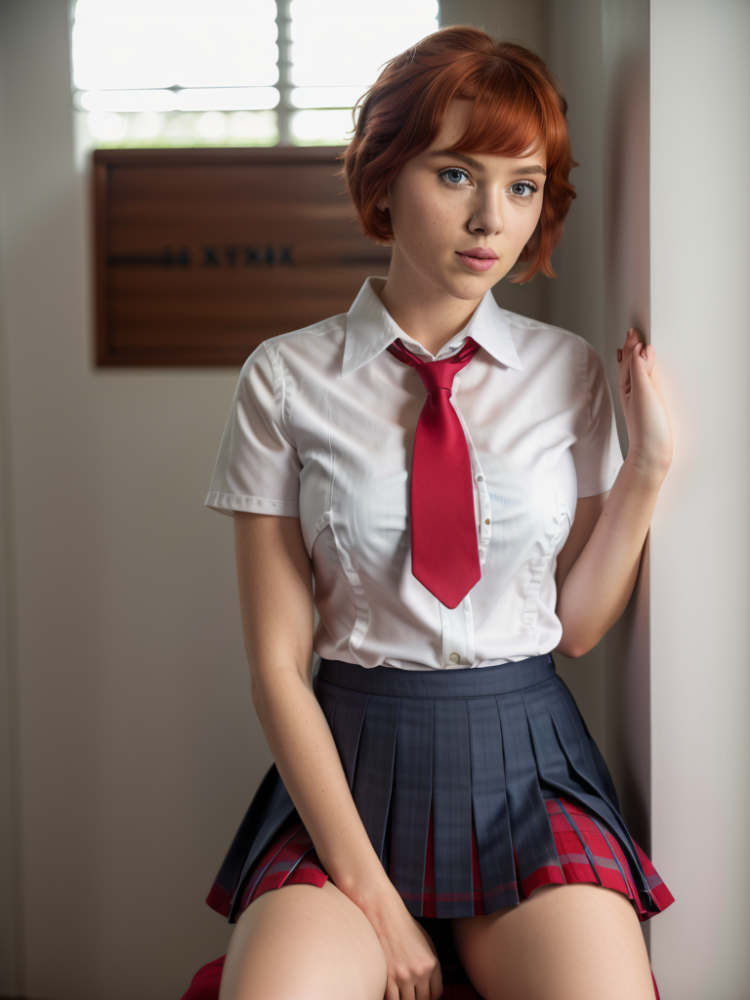
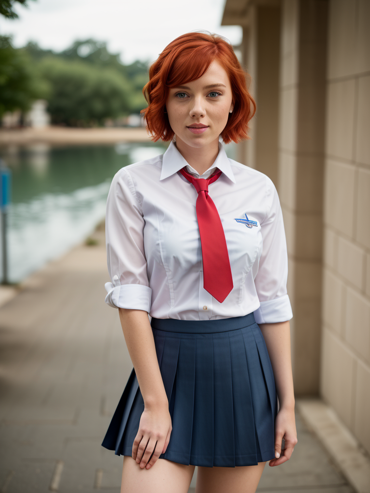
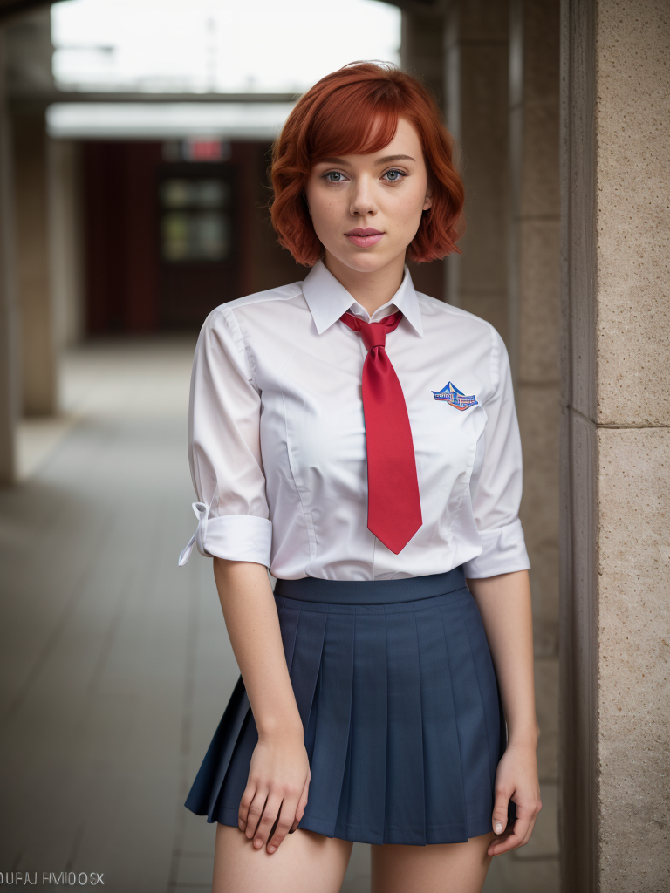

#  Multi-LoRA Composition for Image Generation
<p align="center">
  <a href="https://maszhongming.github.io/Multi-LoRA-Composition/"></a>
  <a href="https://github.com/maszhongming/Multi-LoRA-Composition"></a>
  <a href="https://drive.google.com/file/d/1SuwRgV1LtEud8dfjftnw-zxBMgzSCwIT/view?usp=sharing" ></a>
</p>

🖋 **Authors:** [Ming Zhong](https://maszhongming.github.io/), [Yelong Shen](https://scholar.google.com/citations?user=S6OFEFEAAAAJ&hl=en), [Shuohang Wang](https://www.microsoft.com/en-us/research/people/shuowa/), [Yadong Lu](https://adamlu123.github.io/), [Yizhu Jiao](https://yzjiao.github.io/), [Siru Ouyang](https://ozyyshr.github.io/), [Donghan Yu](https://plusross.github.io/), [Jiawei Han](https://hanj.cs.illinois.edu/), [Weizhu Chen](https://www.microsoft.com/en-us/research/people/wzchen/)

## 📜 Overview

Low-Rank Adaptation (LoRA) is extensively utilized in text-to-image models for the accurate rendition of specific elements like distinct characters or unique styles in generated images.

Our project presents two training-free methods: **LoRA Switch** and **LoRA Composite** for integrating any number of elements in an image through multi-LoRA composition.

The figure below illustrates differences between the traditional LoRA Merge approach and our newly proposed techniques:

<p align="center">
    
</p>

## 🚀 Getting Started

### Setting Up the Environment
To begin, set up your environment with the necessary packages:
```bash
conda create --name multi-lora python=3.10
conda activate multi-lora
pip install -r requirements.txt
```

### Downloading Pre-trained LoRAs
Our **ComposLoRA** testbed collects 22 pre-trained LoRAs, spanning characters, clothing, styles, backgrounds, and objects. Download `ComposLoRA.zip` from [this link](https://drive.google.com/file/d/1SuwRgV1LtEud8dfjftnw-zxBMgzSCwIT/view?usp=sharing), put it in the [models](./models) folder, and unzip it.

## 🖼️ Image Generation with Multi-LoRA Composition

To compose multiple LoRAs using different methods during image generation, follow these steps:

First, load the base model:

```python
from diffusers import DiffusionPipeline

pipeline = DiffusionPipeline.from_pretrained(
    'SG161222/Realistic_Vision_V5.1_noVAE',
    custom_pipeline="MingZhong/StableDiffusionPipeline-with-LoRA-C",
    use_safetensors=True
).to("cuda")
```

This model from Hugging Face is selected for realistic-style image generation. Additionally, our custom pipeline integrates the LoRA composite method into the standard Stable Diffusion pipeline.

Next, choose a character LoRA and a clothing LoRA from ComposLoRA for composition:

```python
# Load LoRAs
lora_path = 'models/lora/reality'
pipeline.load_lora_weights(lora_path, weight_name="character_2.safetensors", adapter_name="character")
pipeline.load_lora_weights(lora_path, weight_name="clothing_2.safetensors", adapter_name="clothing")

# List of LoRAs to be composed
cur_loras = ["character", "clothing"]
```
Select a composition method. "switch" and "composite" are our new proposals, offering alternatives to the traditional "merge" method:

```python
from callbacks import make_callback

method = 'switch'

# Initialize based on the selected composition method
if method == "merge":
    pipeline.set_adapters(cur_loras)
    switch_callback = None
elif method == "switch":
    pipeline.set_adapters([cur_loras[0]])
    switch_callback = make_callback(switch_step=args.switch_step, loras=cur_loras)
else:
    pipeline.set_adapters(cur_loras)
    switch_callback = None
```

Finally, set your prompt and generate the image:.

```python
# Set the prompts for image generation
prompt = "RAW photo, subject, 8k uhd, dslr, high quality, Fujifilm XT3, half-length portrait from knees up, scarlett, short red hair, blue eyes, school uniform, white shirt, red tie, blue pleated microskirt"
negative_prompt = "extra heads, nsfw, deformed iris, deformed pupils, semi-realistic, cgi, 3d, render, sketch, cartoon, drawing, anime, text, cropped, out of frame, worst quality, low quality, jpeg artifacts, ugly, duplicate, morbid, mutilated, extra fingers, mutated hands, poorly drawn hands, poorly drawn face, mutation, deformed, blurry, dehydrated, bad anatomy, bad proportions, extra limbs, cloned face, disfigured, gross proportions, malformed limbs, missing arms, missing legs, extra arms, extra legs, fused fingers, too many fingers, long neck"

# Generate and save the image
generator = torch.maunal_seed(11)
image = pipeline(
    prompt=prompt, 
    negative_prompt=negative_prompt,
    height=1024,
    width=768,
    num_inference_steps=100,
    guidance_scale=7,
    generator=generator,
    cross_attention_kwargs={"scale": 0.8},
    callback_on_step_end=switch_callback,
    lora_composite=True if method == "composite" else False
).images[0]
image.save('example.png')
```

Refer to `example.py` for the full code, and adjust the following command to see results from different composition methods:

```bash
python example.py --method switch
```

Images generated by each of the three methods are showcased below:

<p align="center">
  
  
  
</p>

## 🎨 Experiments on ComposLoRA

**ComposLoRA** features 22 LoRAs and 480 different composition sets, allowing for the generation of images with any composition of 2-5 LoRAs, including at least one character LoRA.

### Image Generation
To generate anime-style images incorporating 2 LoRAs using LoRA Composite method, use the following command:

```bash
export CUDA_VISIBLE_DEVICES=0

python compose_lora.py \
    --method composite \
    --compos_num 2 \
    --save_path output \
    --lora_scale 0.8 \
    --image_style anime \
    --denoise_steps 200 \
    --cfg_scale 10 \
```

Adjust the parameters in `compos_reality.sh` and `compose_anime.sh` for different compositions.

### Comparative Evaluation with GPT-4V

For comparative evaluation on composition efficacy and image quality, we use GPT-4V. Set your OpenAI API key first:

```bash
export OPENAI_API_KEY='your_openai_api_key_here'
```

Then, compare the composite and merge methods with this command:

```bash
python evaluate.py \
    --base_method merge \
    --comp_method composite \
    --compos_num 2 \
    --image_style anime \
    --image_path output \
    --save_path eval_result \
```

Modify `eval.sh` for comparative evaluation under different conditions. Note the position bias of GPT-4V as mentioned in our paper, making it essential to input images in both orders and average the scores for a fair final assessment.

## Human Evaluation
We also conduct human evaluations on 120 generated images to assess composition and image quality from a human perspective. These evaluations offer additional insights into the performance of our Multi-LoRA Composition methods and metrics. For detailed information on the evaluation process and results, please visit the [human_eval](./human_eval) folder.

## 📚 Citation
If you find this work useful, please kindly cite our paper:
```
@article{zhong2024multi,
    title={Multi-LoRA Composition for Image Generation},
    author={Zhong, Ming and Shen, Yelong and Wang, Shuohang and Lu, Yadong and Jiao, Yizhu and Ouyang, Siru and Yu, Donghan and Han, Jiawei and Chen, Weizhu},
    journal={arXiv preprint},
    year={2024}
}
```

